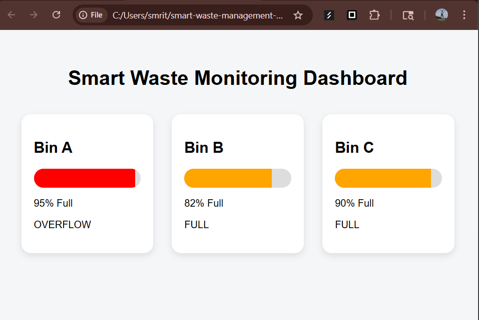

# Smart Bin Monitoring System 🚮

An IoT + software prototype for monitoring waste-bin fill levels, prioritizing pickups, predicting overflow, and visualizing bin status through a lightweight dashboard.

Built as a smart-city prototype combining embedded systems and backend intelligence.

---

## Problem

Traditional waste collection is mostly reactive:

- Bins overflow before collection  
- Pickup routes are inefficient  
- No real-time fill visibility  
- No predictive planning  

This project explores how low-cost sensing and simple optimization can improve waste monitoring.

---

# Features

## Smart Bin Prototype
- Ultrasonic fill-level detection  
- Three-state alert logic:
  - Normal
  - Warning
  - Overflow
- Green/Red LED indicators  
- Overflow buzzer alert  

---

## Backend & Analytics
- Pickup prioritization algorithm  
- Fill-level scoring heuristic  
- Overflow prediction  
- Sensor anomaly detection  
- Bin data logging (CSV)  
- Flask REST API  
- Interactive monitoring dashboard  
- Simulated live telemetry visualization  

---

# Components Used

## Hardware
- Arduino Uno  
- HC-SR04 Ultrasonic Sensor  
- Green and Red LEDs  
- Piezo Buzzer  
- 220Ω Resistors  
- Breadboard + Jumper Wires  

## Software
- Arduino C/C++  
- Python  
- Flask  
- Tinkercad  
- Git & GitHub  

---

# Bin Logic

Distance thresholds:

```text
> 20 cm   → Normal

10–20 cm  → Warning

< 10 cm   → Overflow
```

---

# Pickup Optimization Logic

Priority score:

```text
score = fill % / distance
```

Higher score → higher pickup priority.

---

# Overflow Prediction

Estimated time-to-full:

```text
(100 - current_fill) / growth_rate
```

Used to predict possible overflow.

---

# REST API Endpoints

```text
/bins
/pickup-priority
/predict/<fill>/<growth>
/dashboard
/anomaly-check/<fill>
```

---

# Prototype Validation

## Normal State


## Warning State


## Overflow Alert


---

# Dashboard Preview

Interactive monitoring dashboard:



Includes:
- Fill percentage monitoring  
- Status indicators  
- Simulated live telemetry  

---

# Project Structure

```text
smart-bin-monitoring-system/
│
├── backend/
│   ├── app.py
│   ├── route_optimizer.py
│   ├── fill_prediction.py
│   └── requirements.txt
│
├── dashboard/
│   ├── index.html
│   ├── style.css
│   └── script.js
│
├── firmware/
│   ├── platformio.ini
│   └── src/
│       └── main.cpp
│
├── hardware/
│   ├── components-list.md
│   └── tinkercad/
│       └── tinkercad_test.ino
│
├── datasets/
│   └── sample_fill_data.csv
│
├── docs/
│   └── threat-model.md
│
├── images/
│   ├── bin-normal.png
│   ├── bin-warning.png
│   ├── bin-overflow.png
│   └── dashboard-ui.png
│
├── .gitignore
├── README.md
└── LICENSE
```

---

# Run Locally

## Start Backend

```bash
pip install -r backend/requirements.txt
python backend/app.py
```

Open:

```text
http://127.0.0.1:5000/dashboard
```

---

## Run Tinkercad Simulation

1. Open the circuit  
2. Upload:

```text
hardware/tinkercad/tinkercad_test.ino
```

3. Start simulation  
4. Move object to simulate changing bin fill level  

---

# Future Scope

Possible upgrades:
- Live MQTT sensor telemetry  
- Multi-bin fleet simulation  
- Route optimization using OR-Tools  
- GPS-enabled smart bins  
- ML-based fill forecasting  

---

# Security Considerations

Threats considered:
- Sensor spoofing  
- MQTT tampering  
- Device cloning  

Basic mitigations documented in:

```text
docs/threat-model.md
```

---

# Why This Project

This project combines:

- Embedded Systems  
- IoT  
- Optimization  
- Backend APIs  
- Smart-city concepts  

Built as both a learning project and a scalable prototype.

---

## Author
Smruthi Nayak  
BTech CSE (IoT)