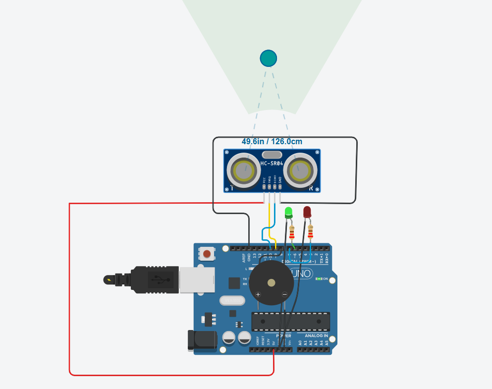
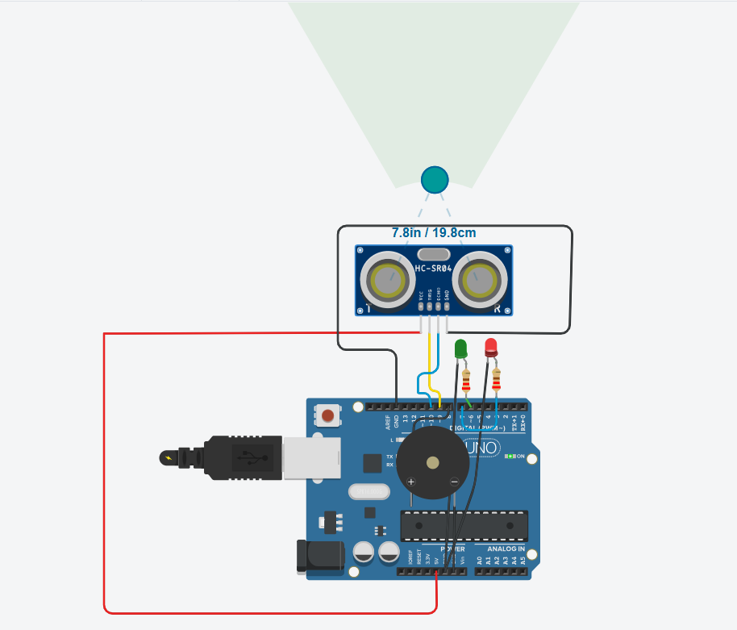
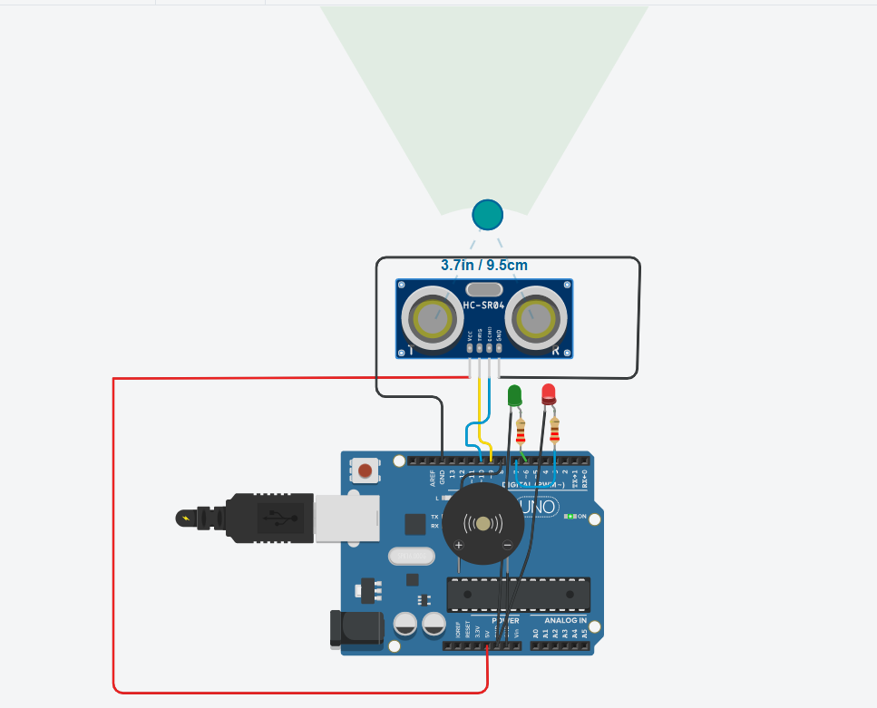

# Smart Bin Monitoring System 🚮

An IoT and software prototype for monitoring waste bins, prioritizing pickups, predicting overflow, and visualizing bin status through a lightweight backend dashboard.

Built as an embedded + backend smart-city prototype.

---

## Problem

Traditional waste collection is reactive:

- Bins overflow before collection
- Pickup routes are inefficient
- No fill-level visibility
- No predictive planning

This project explores how low-cost sensing + simple optimization can improve that.

---

# Features

## Smart Bin Prototype
- Fill-level detection using ultrasonic sensor
- Three-state alert logic:
  - Normal
  - Warning
  - Overflow
- Green/Red LED indicators
- Buzzer overflow alert

---

## Backend Intelligence (Version 2)
- Pickup prioritization algorithm
- Route scoring heuristic
- Fill overflow prediction
- Sensor anomaly detection
- Bin data logging (CSV)
- Flask REST API
- Web dashboard

---

# Components Used

Hardware:
- Arduino Uno
- HC-SR04 Ultrasonic Sensor
- 2 LEDs
- Piezo Buzzer
- 220Ω Resistors
- Breadboard + Jumper Wires

Software:
- Arduino C/C++
- Python
- Flask
- Tinkercad
- Git/GitHub

---

# Bin Logic

Distance Thresholds:

```text
> 20 cm   → Normal

10–20 cm  → Warning

< 10 cm   → Overflow
```

---

# Optimization Logic

Pickup priority uses:

Priority Score:

score = fill % / distance

Higher score = higher pickup priority.

---

# Overflow Prediction

Uses simple prediction:

time_to_full =
(100-current_fill) / growth_rate

Used to estimate when a bin may overflow.

---

# REST API Endpoints

Available routes:

```text
/bins
/pickup-priority
/predict/<fill>/<growth>
/dashboard
/anomaly-check/<fill>
```

---

# Dashboard Demo

Web dashboard shows:

- Bin fill %
- Status
- Overflow conditions

Example:

```text
Bin A 95% OVERFLOW
Bin B 82% FULL
Bin C 90% FULL
```

---

# Prototype Validation

## Normal State


## Warning State


## Overflow State


---

# Project Structure

```text
smart-bin-monitoring-system/
├── backend/
│   ├── app.py
│   ├── route_optimizer.py
│   ├── fill_prediction.py
│
├── firmware/
├── hardware/
├── datasets/
├── images/
└── README.md
```

---

# Run Locally

## Flask Backend

```bash
pip install -r backend/requirements.txt
python backend/app.py
```

Visit:

```text
http://127.0.0.1:5000/dashboard
```

---

## Tinkercad Simulation

1 Open circuit

2 Upload:

```text
hardware/tinkercad/tinkercad_test.ino
```

3 Start simulation

4 Move object to simulate waste fill level.

---

# Future Scope
Potential next upgrades:
- Live MQTT sensor telemetry
- Multi-bin fleet simulation
- Route optimization using OR-Tools
- GPS-enabled smart bins
- ML-based fill forecasting

---

# Why This Project
This project combines:

- Embedded Systems  
- IoT  
- Basic Optimization  
- Backend APIs  
- Smart-city concepts

Built as both a learning project and scalable prototype.

---
Author:
Smruthi Nayak
BTech CSE (IoT)